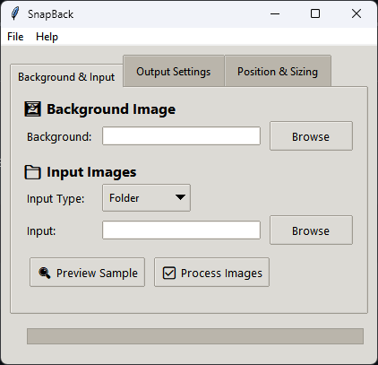
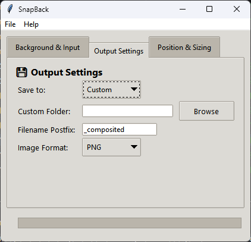
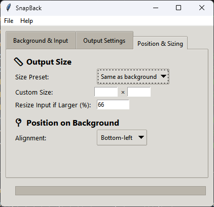

# 🖼️ SnapBack

SnapBack is a lightweight desktop tool that lets you place screenshots or UI captures over a background image — quickly, repeatedly, and with minimal friction.  

Originally built out of necessity and "vibe-coded" using ChatGPT, this tool came to life because I needed to paste dozens of application screenshots on a static Windows wallpaper for work. Instead of doing it manually in Photoshop over and over again… I wrote this.

---

<div align="center">
  
</div>

---

## ✨ Features

- 📂 Drag-and-drop support for input files/folders and background images
- 🔁 Batch processing: overlay a folder of screenshots
- 📐 Adjustable alignment (center, top-left, etc.) and resizing
- 🖼 Preview before processing
- 💾 Output formats: PNG, JPG, WEBP
- 🧠 Remembers your background and output preferences
- 🤐 Doesn’t remember input files — by design

---

## 🔽 Download

👉 **[Download the latest SnapBack.exe](https://github.com/MehdiBazyar99/SnapBack/releases/latest)**  
No installation required — just run the `.exe`.

> ⚠️ Windows only. You might need to bypass SmartScreen by clicking "More info → Run anyway".

---

## 🛠 Installation from Source (Python)

If you’re not on Windows or want to inspect/modify the code:

### 1. Clone the repo

```bash
git clone https://github.com/MehdiBazyar99/SnapBack.git
cd SnapBack
```

### 2. Install dependencies

```bash
pip install -r requirements.txt
```

> If `tkinterdnd2` fails, try:
> ```bash
> python -m pip install tkinterdnd2
> ```

### 3. Run the tool

```bash
python main.py
```

---

## ⚙️ Building a `.exe` (Optional)

To build your own version:

1. Install PyInstaller  
   ```bash
   pip install pyinstaller
   ```

2. Build the executable  
   ```bash
   pyinstaller --onefile --windowed --icon=snapback_logo.ico --name=SnapBack main.py
   ```

Output will be in the `dist/` folder.

---

## 🧩 How to Use

1. **Choose a background** image (drag-and-drop works)
2. **Add input image(s)** – one file or a whole folder
3. **Set output preferences** – format, name postfix, folder
4. **Configure size/alignment** – center, top-left, etc.
5. Click **Preview Sample** or **Process Images**

---

## 🧠 How SnapBack Remembers Stuff

✅ Remembers:
- Background image path
- Output folder and format
- Alignment and size settings

🚫 Doesn’t remember:
- Last input file/folder (for simplicity and privacy)

---

## 📸 Screenshots

<div align="center">
  
  <br/><br/>
  
  <br/><br/>
  
</div>

---

## 🙋‍♂️ Who Made This?

Hi, I'm [**Mehdi**](https://github.com/MehdiBazyar99) 👋  
This was one of those “I need this now and I don’t want to overthink it” tools.  
Written in Python with Tkinter and some help from ChatGPT.

If this helped you too, feel free to fork it, suggest improvements, or just say hi.

---

## 📃 License

This project is licensed under the **MIT License**.  
Use it freely, improve it, or build your own SnapBack.
